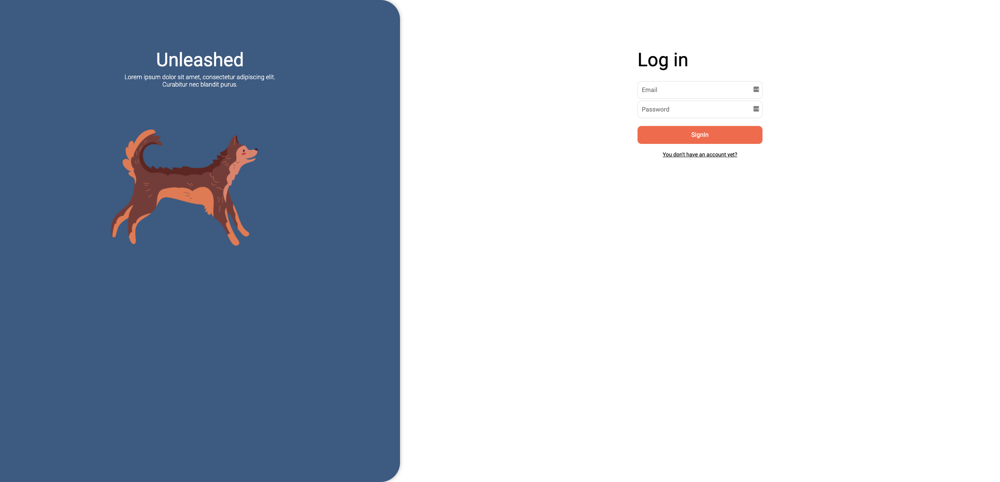
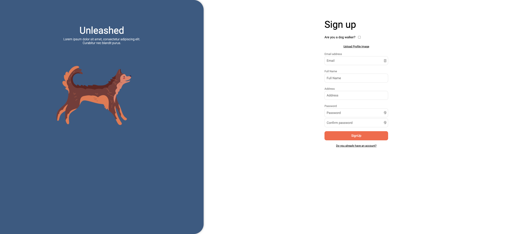
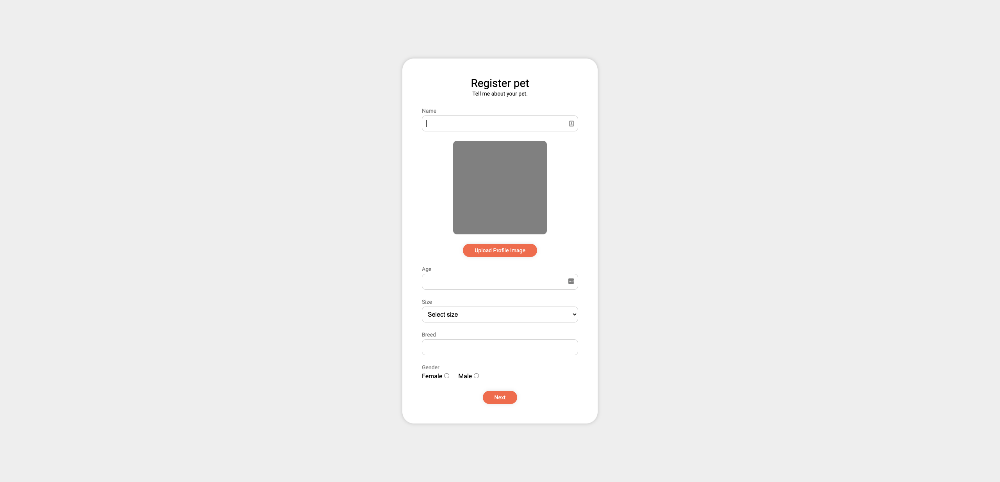
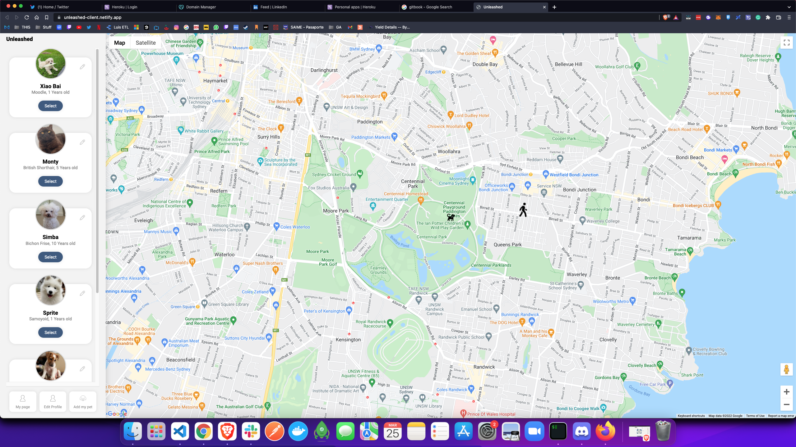
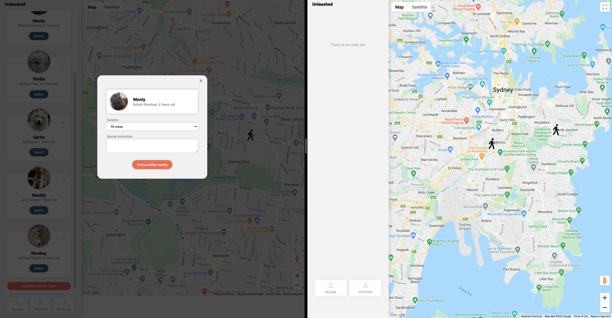
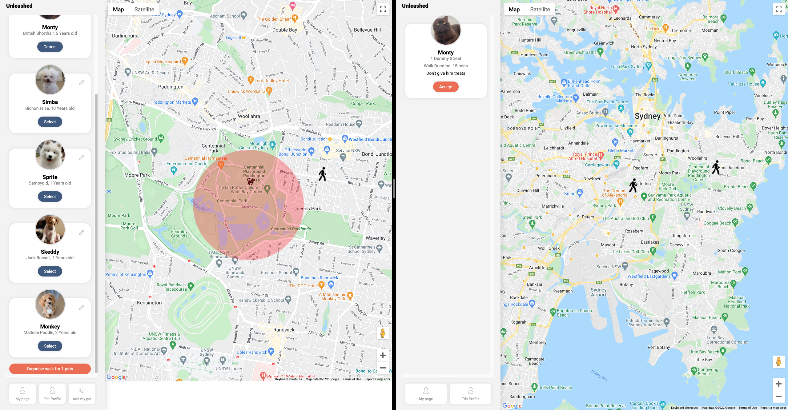
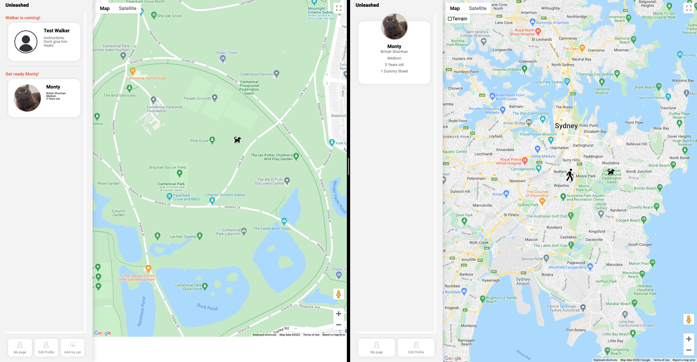
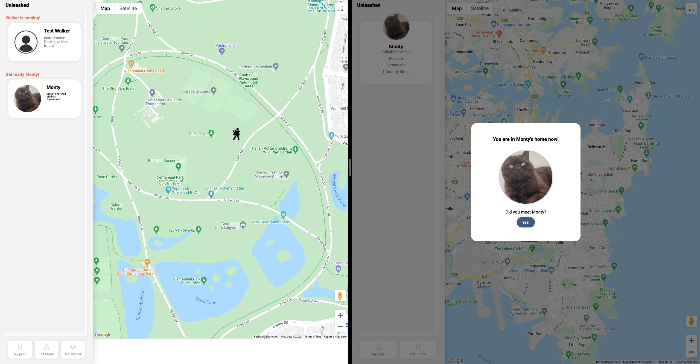
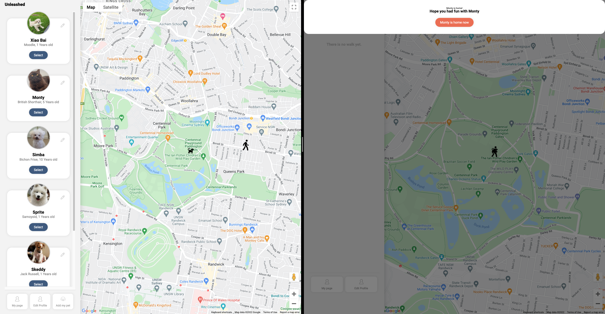

# Unleashed
> Organise a walk for your pet, and track their movements.
> Live demo [_here_](https://unleashed-client.netlify.app). 

## Table of Contents
* [General Info](#general-information)
* [Technologies Used](#technologies-used)
* [Features](#features)
* [Screenshots](#screenshots)
* [Credits](#credits)
<!-- * [License](#license) -->

## General Information
- A dog walking Application that allows users to set up walks for 
their dogs, and track the movement of their walker and Pet. 

## Technologies Used
- Sass
- React.js
- Ruby On Rails
- Google Maps API
- Cloudinary to upload pet & profile images
- PostGreSQL

## Features
- Ability to sign up and add your pets. 
- Arrange for a walker to come to your location and pick up your pet. 
- Live tracking of the walker from when they pick up your pet, go on a walk and are returning. 

## Screenshots

## Credits
The four primary contributors are [thelorddoyle](https://github.com/thelorddoyle/), [Jesus-fhz](https://github.com/Jesus-fhz), [impetusdev](https://github.com/impetusdev) and [jiasong214](https://github.com/jiasong214)
